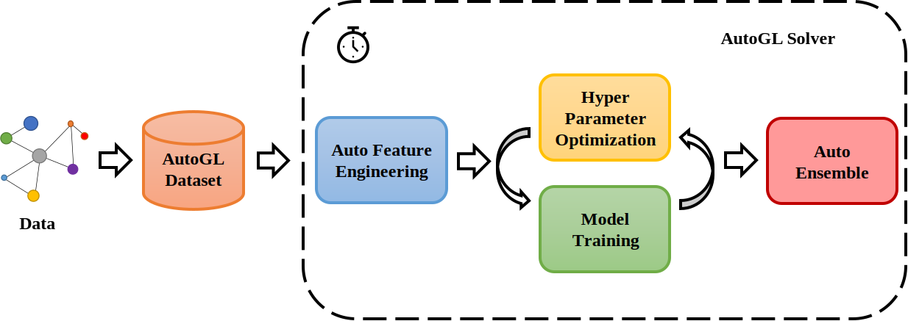

# Auto Graph Learning

[Chinese Introduction](README_cn.md)

An autoML framework & toolkit for machine learning on graphs.

*Actively under development by @THUMNLab*

Feel free to open <a href="https://github.com/THUMNLab/AutoGL/issues">issues</a> or contact us at <a href="mailto:autogl@tsinghua.edu.cn">autogl@tsinghua.edu.cn</a> if you have any comments or suggestions!

<!--
 [](https://github.com/psf/black)
% [](http://mn.cs.tsinghua.edu.cn/autogl/documentation/?badge=latest)-->

## News!

- 2022.12.30 New version! v0.4.0-pre is here!
    - We have proposed __NAS-Bench-Graph__ ([paper](https://openreview.net/pdf?id=bBff294gqLp), [code](https://github.com/THUMNLab/NAS-Bench-Graph), [tutorial](http://mn.cs.tsinghua.edu.cn/autogl/documentation/docfile/tutorial/t_nas_bench_graph.html)), the first NAS-benchmark for graphs published in NeurIPS'22. By using AutoGL together with NAS-Bench-Graph, the performance estimation process of GraphNAS algorithms can be greatly speeded up. 
    - We have supported the graph __robustness__ algorithms in AutoGL, including graph structure engineering, robust GNNs and robust GraphNAS. See [robustness tutorial](http://mn.cs.tsinghua.edu.cn/autogl/documentation/docfile/tutorial/t_robust.html) for more details.
    - We have supported graph __self-supervised learning__! See [self-supervised learning tutorial](http://mn.cs.tsinghua.edu.cn/autogl/documentation/docfile/tutorial/t_ssl_trainer.html) for more details.
- 2021.12.31 Version v0.3.0-pre is released
    - Support [__Deep Graph Library (DGL)__](https://www.dgl.ai/) backend including homogeneous node classification, link prediction, and graph classification tasks. AutoGL is also compatible with PyG 2.0 now.
    - Support __heterogeneous__ node classification! See [hetero tutorial](http://mn.cs.tsinghua.edu.cn/autogl/documentation/docfile/tutorial/t_hetero_node_clf.html) .
    - The module `model` now supports __decoupled__ to two additional sub-modules named `encoder` and `decoder`. Under the __decoupled__ design, one `encoder` can be used to solve all kinds of tasks.
    - Enrich [NAS algorithms](http://mn.cs.tsinghua.edu.cn/autogl/documentation/docfile/tutorial/t_nas.html) such as [AutoAttend](https://proceedings.mlr.press/v139/guan21a.html), [GASSO](https://proceedings.neurips.cc/paper/2021/hash/8c9f32e03aeb2e3000825c8c875c4edd-Abstract.html), [hardware-aware algorithm](http://mn.cs.tsinghua.edu.cn/autogl/documentation/docfile/documentation/nas.html#autogl.module.nas.estimator.OneShotEstimator_HardwareAware), etc. 
- 2021.07.11 Version 0.2.0-pre is released, which supports [neural architecture search (NAS)](http://mn.cs.tsinghua.edu.cn/autogl/documentation/docfile/tutorial/t_nas.html) to customize architectures, [sampling] (http://mn.cs.tsinghua.edu.cn/autogl/documentation/docfile/tutorial/t_trainer.html#node-classification-with-sampling) to perform tasks on large datasets, and link prediction. 
- 2021.04.16 Our survey paper about automated machine learning on graphs is accepted by IJCAI! See more [here](http://arxiv.org/abs/2103.00742).
- 2021.04.10 Our paper [__AutoGL: A Library for Automated Graph Learning__](https://arxiv.org/abs/2104.04987) is accepted by _ICLR 2021 Workshop on Geometrical and Topological Representation Learning_! You can cite our paper following methods [here](#Cite).

## Introduction

AutoGL is developed for researchers and developers to conduct autoML on graph datasets and tasks easily and quickly. See our documentation for detailed information!

The workflow below shows the overall framework of AutoGL.



AutoGL uses `datasets` to maintain datasets for graph-based machine learning, which is based on Dataset in PyTorch Geometric or Deep Graph Library with some functions added to support the auto solver framework.

Different graph-based machine learning tasks are handled by different `AutoGL solvers`, which make use of five main modules to automatically solve given tasks, namely `auto feature engineer`, `neural architecture search`, `auto model`, `hyperparameter optimization`, and `auto ensemble`. 

Currently, the following algorithms are supported in AutoGL:


<table>
    <tbody>
    <tr valign="top">
        <td>Feature Engineer</td>
        <td>Model</td>
        <td>NAS</td>
        <td>HPO</td>
        <td>Ensemble</td>
    </tr>
    <tr valign="top">
        <!--<td><b>Generators</b><br>graphlet <br> eigen <br> pagerank <br> PYGLocalDegreeProfile <br> PYGNormalizeFeatures <br> PYGOneHotDegree <br> onehot <br> <br><b>Selectors</b><br> SeFilterConstant<br> gbdt <br> <br><b>Subgraph</b><br> NxLargeCliqueSize<br> NxAverageClusteringApproximate<br> NxDegreeAssortativityCoefficient<br> NxDegreePearsonCorrelationCoefficient<br> NxHasBridge <br>NxGraphCliqueNumber<br> NxGraphNumberOfCliques<br> NxTransitivity<br> NxAverageClustering<br> NxIsConnected<br> NxNumberConnectedComponents<br> NxIsDistanceRegular<br> NxLocalEfficiency<br> NxGlobalEfficiency<br> NxIsEulerian </td>-->
        <td><b>Generators</b><br>Graphlets <br> EigenGNN <br> <a href="http://mn.cs.tsinghua.edu.cn/autogl/documentation/docfile/tutorial/t_fe.html">more ...</a><br><br><b>Selectors</b><br> SeFilterConstant<br> gbdt <br> <br><b>Graph</b><br> netlsd<br> NxAverageClustering<br> <a href="http://mn.cs.tsinghua.edu.cn/autogl/documentation/docfile/tutorial/t_fe.html">more ...</a></td>
        <td><b>Homo Encoders</b><br> GCNEncoder <br> GATEncoder <br> SAGEEncoder <br> GINEncoder <br> <br><b>Decoders</b><br>LogSoftmaxDecoder <br> DotProductDecoder <br> SumPoolMLPDecoder <br> JKSumPoolDecoder </td>
        <td>
        <b>Algorithms</b><br>
        Random<br>
        RL<br>
        Evolution<br>
        GASSO<br>
        <a href='http://mn.cs.tsinghua.edu.cn/autogl/documentation/docfile/documentation/nas.html'>more ...</a><br><br>
        <b>Spaces</b><br>
        SinglePath<br>
        GraphNas<br>
        AutoAttend<br>
        <a href='http://mn.cs.tsinghua.edu.cn/autogl/documentation/docfile/documentation/nas.html'>more ...</a><br><br>
        <b>Estimators</b><br>
        Oneshot<br>
        Scratch<br>
        </td>
        <td> Grid <br> Random <br> Anneal <br> Bayes <br> CAMES <br> MOCAMES <br> Quasi random <br> TPE <br> AutoNE </td>
        <td> Voting <br> Stacking </td>
    </tr>
    </tbody>
</table>

This toolkit also serves as a framework for users to implement and test their own autoML or graph-based machine learning models.

## Installation

### Requirements

Please make sure you meet the following requirements before installing AutoGL.

1. Python >= 3.6.0

2. PyTorch (>=1.6.0)

    see <https://pytorch.org/> for installation.

3. Graph Library Backend

    You will need either PyTorch Geometric (PyG) or Deep Graph Library (DGL) as the backend. You can select a backend following [here](http://mn.cs.tsinghua.edu.cn/autogl/documentation/docfile/tutorial/t_backend.html) if you install both.

    3.1 PyTorch Geometric (>=1.7.0)

    See <https://pytorch-geometric.readthedocs.io/en/latest/notes/installation.html/> for installation.

    3.2 Deep Graph Library (>=0.7.0)

    See <https://dgl.ai/> for installation.


### Installation

#### Install from pip

Run the following command to install this package through `pip`.

```
pip install autogl
```

#### Install from source

Run the following command to install this package from the source.

```
git clone https://github.com/THUMNLab/AutoGL.git
cd AutoGL
python setup.py install
```

#### Install for development

If you are a developer of the AutoGL project, please use the following command to create a soft link, then you can modify the local package without install them again.

```
pip install -e .
```

## Documentation

Please refer to our <a href="http://mn.cs.tsinghua.edu.cn/autogl/documentation/">documentation</a> to see the detailed documentation.

You can also make the documentation locally. First, please install sphinx and sphinx-rtd-theme:
```
pip install -U Sphinx
pip install sphinx-rtd-theme
```
Then, make an html documentation by:
```
cd docs
make clean && make html
```

The documentation will be automatically generated under `docs/_build/html`

## Cite

Please cite [our paper](https://openreview.net/forum?id=0yHwpLeInDn) as follows if you find our code useful:
```
@inproceedings{
guan2021autogl,
title={Auto{GL}: A Library for Automated Graph Learning},
author={Chaoyu Guan and Ziwei Zhang and Haoyang Li and Heng Chang and Zeyang Zhang and Yijian Qin and Jiyan Jiang and Xin Wang and Wenwu Zhu},
booktitle={ICLR 2021 Workshop on Geometrical and Topological Representation Learning},
year={2021},
url={https://openreview.net/forum?id=0yHwpLeInDn}
}
```

You may also find our [survey paper](http://arxiv.org/abs/2103.00742) helpful:
```
@article{zhang2021automated,
  title={Automated Machine Learning on Graphs: A Survey},
  author={Zhang, Ziwei and Wang, Xin and Zhu, Wenwu},
  booktitle = {Proceedings of the Thirtieth International Joint Conference on Artificial Intelligence, {IJCAI-21}},
  year={2021},
  note={Survey track}
}
```

## License
We follow [Apache license](LICENSE) across the entire codebase from v0.2.
