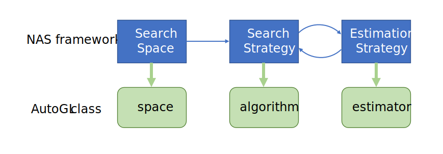

.. _nas:

Neural Architecture Search
============================

We support different neural architecture search algorithm in variant search space.
Neural architecture search is usually constructed by three modules: search space, search strategy and estimation strategy.

The search space describes all possible architectures to be searched. There are mainly two parts of the space formulated, the operations(e.g. GCNconv, GATconv) and the input-ouput relations.
A large space may have better optimal architecture but demands more effect to explore.
Human knowledge can help to design a reasonable search space to reduce the efforts of search strategy.

The search strategy controls how to explore the search space. 
It encompasses the classical exploration-exploitation trade-off since.
On the one hand, it is desirable to find well-performing architectures quickly, 
while on the other hand, premature convergence to a region of suboptimal architectures should be avoided.

The estimation strategy gives the performance of certain architectures when it is explored.
The simplest option is to perform a standard training and validation of the architecture on data.
Since there are lots of architectures need estimating in the whole searching process, estimation strategy is desired to be very efficient to save computational resources.

To be more flexible, we modulize NAS process with three part: algorithm, space and estimator, corresponding to the three module search space, search strategy and estimation strategy.
Different models in different parts can be composed in some certain constrains.
If you want to design your own NAS process, you can change any of those parts according to your demand.

Usage
-----

You can directly enable architecture search for node classification tasks by passing the algorithms, spaces and estimators to
solver. Following shows an example:

.. code-block:: python

    # Use graphnas to solve cora
    from autogl.datasets import build_dataset_from_name
    from autogl.solver import AutoNodeClassifier

    solver = AutoNodeClassifier(
        feature = 'PYGNormalizeFeatures',
        graph_models = (),
        hpo = 'tpe',
        ensemble = None,
        nas_algorithms=['rl'],
        nas_spaces='graphnasmacro',
        nas_estimators=['scratch']
    )

    cora = build_dataset_from_name('cora')
    solver.fit(cora)

The code above will first find the best architecture in space ``graphnasmacro`` using ``rl`` search algorithm.
Then the searched architecture will be further optimized through hyperparameter-optimization ``tpe``.

.. note:: The ``graph_models`` argument is not conflict with nas module. You can set ``graph_models`` to
    other hand-crafted models beside the ones found by nas. Once the architectures are derived from nas module,
    they act in the same way as hand-crafted models directly passed through graph_models.

Search Space
------------

The space definition is base on mutable fashion used in NNI, which is defined as a model inheriting BaseSpace
There are mainly two ways to define your search space, one can be performed with one-shot fashion while the other cannot.
Currently, we support following search space:

+------------------------+-----------------------------------------------------------------+
| Space                  | Description                                                     |
+========================+=================================================================+
| ``singlepath`` [4]_    | Architectures with several sequential layers with each layer    |
|                        | choosing only one path                                          |
+------------------------+-----------------------------------------------------------------+
| ``graphnas``   [1]_    | The graph nas micro search space designed for fully supervised  |
|                        | node classification models                                      |
+------------------------+-----------------------------------------------------------------+
| ``graphnasmacro`` [1]_ | The graph nas macro search space designed for semi-superwised   |
|                        | node classification models                                      |
+------------------------+-----------------------------------------------------------------+

You can also define your own nas search space. 
If you need one-shot fashion, you should use the function ``setLayerChoice`` and ``setInputChoice`` to construct the super network.
Here is an example.

.. code-block:: python

    # For example, create an NAS search space by yourself
    from autogl.module.nas.space.base import BaseSpace
    from autogl.module.nas.space.operation import gnn_map
    class YourOneShotSpace(BaseSpace):
        # Get essential parameters at initialization
        def __init__(self, input_dim = None, output_dim = None):
            super().__init__()
            # must contain input_dim and output_dim in space, or you can initialize these two parameters in function `instantiate`
            self.input_dim = input_dim
            self.output_dim = output_dim

        # Instantiate the super network
        def instantiate(self, input_dim = None, output_dim = None):
            # must call super in this function
            super().instantiate()
            self.input_dim = input_dim or self.input_dim
            self.output_dim = output_dim or self.output_dim
            # define two layers with order 0 and 1
            setattr(self, 'layer0', self.setLayerChoice(0, [gnn_map(op,self.input_dim,self.output_dim)for op in ['gcn', 'gat']], key = 'layer0')
            setattr(self, 'layer1', self.setLayerChoice(1, [gnn_map(op,self.input_dim,self.output_dim)for op in ['gcn', 'gat']], key = 'layer1')
            # define an input choice to choose from the result of the two layer
            setattr(self, 'input_layer', self.setInputChoice(2, choose_from = ['layer0', 'layer1'], n_chosen = 1, returen_mask = False, key = 'input_layer'))
            self._initialized = True

        # Define the forward process
        def forward(self, data):
            x, edges = data.x, data.edge_index
            x_0 = self.layer0(x, edges)
            x_1 = self.layer1(x, edges)
            y = self.input_layer([x_0, x_1])
            y = F.log_fostmax(y, dim = 1)
            return y

        # For one-shot fashion, you can directly use following scheme in ``parse_model``
        def parse_model(self, selection, device) -> BaseModel:
            return self.wrap().fix(selection)

Also, you can use the way which does not support one shot fashion.
In this way, you can directly copy you model with few changes.
But you can only use sample-based search strategy.

.. code-block:: python

    # For example, create an NAS search space by yourself
    from autogl.module.nas.space.base import BaseSpace, map_nn
    from autogl.module.nas.space.operation import gnn_map
    # here we search from three types of graph convolution with `head` as a parameter
    # we should search `heads` at the same time with the convolution
    from torch_geometric.nn import GATConv, FeaStConv, TransformerConv
    class YourNonOneShotSpace(BaseSpace):
        # Get essential parameters at initialization
        def __init__(self, input_dim = None, output_dim = None):
            super().__init__()
            # must contain input_dim and output_dim in space, or you can initialize these two parameters in function `instantiate`
            self.input_dim = input_dim
            self.output_dim = output_dim

        # Instantiate the super network
        def instantiate(self, input_dim, output_dim):
            # must call super in this function
            super().instantiate()
            self.input_dim = input_dim or self.input_dim
            self.output_dim = output_dim or self.output_dim
            # set your choices as LayerChoices
            self.choice0 = self.setLayerChoice(0, map_nn(["gat", "feast", "transformer"]), key="conv")
            self.choice1 = self.setLayerChoice(1, map_nn([1, 2, 4, 8]), key="head")

        # You do not need to define forward process here
        # For non-one-shot fashion, you can directly return your model based on the choices
        # ``YourModel`` must inherit BaseSpace.
        def parse_model(self, selection, device) -> BaseModel:
            model = YourModel(selection, self.input_dim, self.output_dim).wrap()
            return model

    # YourModel can be defined as follows
    class YourModel(BaseSpace):
        def __init__(self, selection, input_dim, output_dim):
            self.input_dim = input_dim
            self.output_dim = output_dim
            if selection["conv"] == "gat":
                conv = GATConv
            elif selection["conv"] == "feast":
                conv = FeaStConv
            elif selection["conv"] == "transformer":
                conv = TransformerConv
            self.layer = conv(input_dim, output_dim, selection["head"])

        def forward(self, data):
            x, edges = data.x, data.edge_index
            y = self.layer(x, edges)
            return y

Performance Estimator
---------------------

The performance estimator estimates the performance of an architecture. Currently we support following estimators:

+-------------------------+-------------------------------------------------------+
| Estimator               | Description                                           |
+=========================+=======================================================+
| ``oneshot``             | Directly evaluating the given models without training |
+-------------------------+-------------------------------------------------------+
| ``scratch``             | Train the models from scratch and then evaluate them  |
+-------------------------+-------------------------------------------------------+

You can also write your own estimator. Here is an example of estimating an architecture without training (used in one-shot space).

.. code-block:: python

    # For example, create an NAS estimator by yourself
    from autogl.module.nas.estimator.base import BaseEstimator
    class YourOneShotEstimator(BaseEstimator):
        # The only thing you should do is defining ``infer`` function
        def infer(self, model: BaseSpace, dataset, mask="train"):
            device = next(model.parameters()).device
            dset = dataset[0].to(device)
            # Forward the architecture
            pred = model(dset)[getattr(dset, f"{mask}_mask")]
            y = dset.y[getattr(dset, f'{mask}_mask')]
            # Use default loss function and metrics to evaluate the architecture
            loss = getattr(F, self.loss_f)(pred, y)
            probs = F.softmax(pred, dim = 1)
            metrics = [eva.evaluate(probs, y) for eva in self.evaluation]
            return metrics, loss

Search Strategy
---------------

The space strategy defines how to find an architecture. We currently support following search strategies:

+-------------------------+-------------------------------------------------------+
| Strategy                | Description                                           |
+=========================+=======================================================+
| ``random``              | Random search by uniform sampling                     |
+-------------------------+-------------------------------------------------------+
| ``rl`` [1]_             | Use rl as architecture generator agent                |
+-------------------------+-------------------------------------------------------+
| ``enas`` [2]_           | efficient neural architecture search                  |
+-------------------------+-------------------------------------------------------+
| ``darts`` [3]_          | differentiable neural architecture search             |
+-------------------------+-------------------------------------------------------+

Sample-based strategy without weight sharing is simpler than strategies with weight sharing.
We show how to define your strategy here with DFS as an example.
If you want to define more complex strategy, you can refer to Darts, Enas or other strategies in NNI.

.. code-block:: python

    from autogl.module.nas.algorithm.base import BaseNAS
    class RandomSearch(BaseNAS):
        # Get the number of samples at initialization
        def __init__(self, n_sample):
            super().__init__()
            self.n_sample = n_sample

        # The key process in NAS algorithm, search for an architecture given space, dataset and estimator
        def search(self, space: BaseSpace, dset, estimator):
            self.estimator=estimator
            self.dataset=dset
            self.space=space
                
            self.nas_modules = []
            k2o = get_module_order(self.space)
            # collect all mutables in the space
            replace_layer_choice(self.space, PathSamplingLayerChoice, self.nas_modules)
            replace_input_choice(self.space, PathSamplingInputChoice, self.nas_modules)
            # sort all mutables with given orders
            self.nas_modules = sort_replaced_module(k2o, self.nas_modules) 
            # get a dict cantaining all chioces
            selection_range={}
            for k,v in self.nas_modules:
                selection_range[k]=len(v)
            self.selection_dict=selection_range
                
            arch_perfs=[]
            # define DFS process
            self.selection = {}
            last_k = list(self.selection_dict.keys())[-1]
            def dfs():
                for k,v in self.selection_dict.items():
                    if not k in self.selection:
                        for i in range(v):
                            self.selection[k] = i
                            if k == last_k:
                                # evaluate an architecture
                                self.arch=space.parse_model(self.selection,self.device)
                                metric,loss=self._infer(mask='val')
                                arch_perfs.append([metric, self.selection.copy()])
                            else:
                                dfs()
                        del self.selection[k]
                        break
            dfs()

            # get the architecture with the best performance
            selection=arch_perfs[np.argmax([x[0] for x in arch_perfs])][1]
            arch=space.parse_model(selection,self.device)
            return arch 

Different search strategies should be combined with different search spaces and estimators in usage.

+----------------+-------------+-------------+------------------+
| Space          | single path | GraphNAS[1] | GraphNAS-macro[1]|
+================+=============+=============+==================+
| Random         |  ✓          |  ✓          |  ✓               | 
+----------------+-------------+-------------+------------------+
| RL             |  ✓          |  ✓          |  ✓               |
+----------------+-------------+-------------+------------------+
| GraphNAS [1]_  |  ✓          |  ✓          |  ✓               |
+----------------+-------------+-------------+------------------+
| ENAS [2]_      |  ✓          |             |                  |
+----------------+-------------+-------------+------------------+
| DARTS [3]_     |  ✓          |             |                  |
+----------------+-------------+-------------+------------------+

+----------------+-------------+-------------+
| Estimator      | one-shot    | Train       |
+================+=============+=============+
| Random         |             |  ✓          | 
+----------------+-------------+-------------+
| RL             |             |  ✓          |
+----------------+-------------+-------------+
| GraphNAS [1]_  |             |  ✓          |
+----------------+-------------+-------------+
| ENAS [2]_      |  ✓          |             |
+----------------+-------------+-------------+
| DARTS [3]_     |  ✓          |             |
+----------------+-------------+-------------+

.. [1] Gao, Yang, et al. "Graph neural architecture search." IJCAI. Vol. 20. 2020.
.. [2] Pham, Hieu, et al. "Efficient neural architecture search via parameters sharing." International Conference on Machine Learning. PMLR, 2018.
.. [3] Liu, Hanxiao, Karen Simonyan, and Yiming Yang. "DARTS: Differentiable Architecture Search." International Conference on Learning Representations. 2018.
.. [4] Guo, Zichao, et al. “Single Path One-Shot Neural Architecture Search with Uniform Sampling.” European Conference on Computer Vision, 2019, pp. 544–560.
